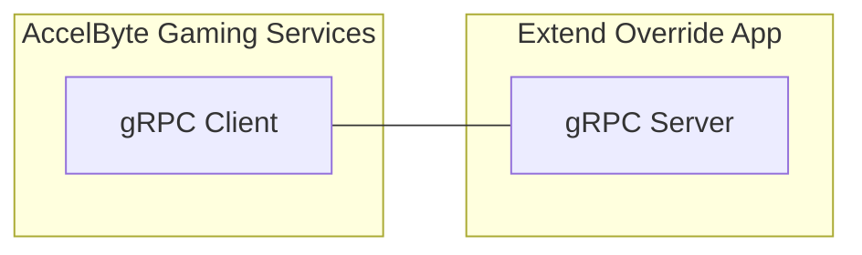
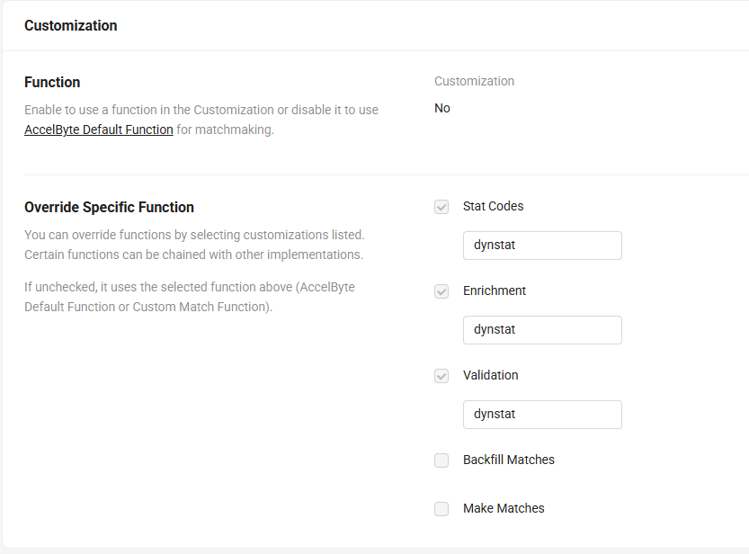

# DynStat Skill Match
Dynamic Stat Skill Matchmaking



Statistic-based matchmaking for AccelByte Gaming Services (AGS), delivered as an Extend Override gRPC plugin server in Go. Players choose a stat (character MMR, mode rank, etc.), the server validates it, enriches the ticket, and lets AGS run its default matching logic.

## Highlights

- **Flexible stat selection**: ticket attributes map `playerID -> stat code` (e.g., `playerA: mmr-ryu`)
- **Dynamic stat codes**: `GetStatCodes` returns only the stats configured in rules
- **Per-player enrichment**: `EnrichTicket` sets each player's selected stat as a standard attribute and cleans up
- **Post-enrichment validation**: `ValidateTicket` checks each player has the enriched attribute
- **Secure and observable**: built-in auth, metrics, traces, and logs
- **AGS default matching**: Do NOT enable `MakeMatches` and `BackfillMatches`, it will return `UNIMPLEMENTED` by design.

## How It Works (Short)

1. Player queues with a stat code in ticket attributes keyed by player ID (e.g., `"playerA": "mmr-ryu"`)
2. `GetStatCodes` tells AGS which stats to fetch
3. `EnrichTicket` extracts each player's selected stat value into `Player.Attributes[enrichedKey]` and removes configured stats
4. `ValidateTicket` checks each player has the enriched attribute
5. AGS matches on the enriched attribute (e.g., `mmr`)

## Match Pool Configuration

In the AGS Admin Portal, enable only these override functions:
- **Stat Codes** - for `GetStatCodes`
- **Enrichment** - for `EnrichTicket`
- **Validation** - for `ValidateTicket`

**Do NOT enable** `Make Matches` or `Backfill Matches` - this plugin delegates matching to AGS default logic.



## Match Ruleset Example

```json
{
    "alliance": {
        "max_number": 2,
        "min_number": 2,
        "player_max_number": 1,
        "player_min_number": 1
    },
    "statistics_config": {
        "statistics": ["mmr-ryu", "mmr-ken"],
        "enriched_key": "mmr"
    },
    "matching_rule": [
        {
            "attribute": "mmr",
            "criteria": "distance",
            "reference": 200,
            "max": 3000
        }
    ]
}
```

### Statistics Config

| Field | Description | Default |
|-------|-------------|---------|
| `statistics` | List of valid stat codes (full names) | Required |
| `enriched_key` | Player attribute key for the enriched stat value | `mmr` |


## Unreal Engine Example

Attach the selected stat key for each player in the party before starting matchmaking:

```cpp
FNamedOnlineSession* PartySession = GetSessionInt()->GetNamedSession(NAME_PartySession);
if (PartySession)
{
    for (const auto& PlayerId : PartySession->RegisteredPlayers)
    {
        FUniqueNetIdAccelByteUserRef AbUserRef = FUniqueNetIdAccelByteUser::Cast(*PlayerId);
        MatchmakingSearchHandle->QuerySettings.Set(
            FName(AbUserRef->GetAccelByteId()),
            TEXT("mmr-ryu"), // todo: fill with selected stat key for each player.
            EOnlineComparisonOp::Equals
        );
    }
}
```

## Quickstart

```shell
cp .env.template .env
docker compose up --build
```

For a full setup guide (prereqs, env vars, and build details), see `docs/setup.md`.

## Documentation

- Setup and prerequisites: `docs/setup.md`
- Local + AGS testing (including observability): `docs/testing.md`
- Deployment and customization tips: `docs/deploying.md`
- Devcontainer: `docs/devcontainer.md`
- AI generation guide: `docs/generate-match-function-with-ai.md`
