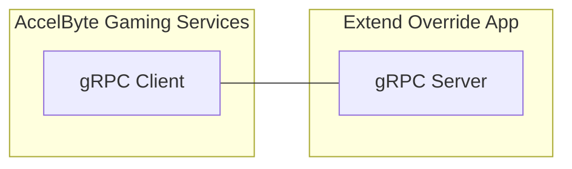

# DynStat Skill Match
Dynamic Stat Skill Matchmaking



Statistic-based matchmaking for AccelByte Gaming Services (AGS), delivered as an Extend Override gRPC plugin server in Go. Players choose a stat (character MMR, mode rank, etc.), the server validates it, enriches the ticket, and lets AGS run its default matching logic.

## Highlights

- **Flexible stat selection**: ticket attributes map `playerID -> stat code` (e.g., `playerA: mmr_ryu`)
- **Dynamic stat codes**: `GetStatCodes` returns only the stats configured in rules
- **Ticket validation + enrichment**: `ValidateTicket` checks selection, `EnrichTicket` sets a standard attribute
- **Secure and observable**: built-in auth, metrics, traces, and logs
- **AGS default matching**: `MakeMatches` and `BackfillMatches` return `UNIMPLEMENTED` by design

## How It Works (Short)

1. Player queues with a stat code in ticket attributes keyed by player ID (e.g., `"playerA": "mmr_ryu"`)
2. `GetStatCodes` tells AGS which stats to fetch
3. `ValidateTicket` checks the stat mapping is present and allowed
4. `EnrichTicket` copies the selected stat value into a standard `mmr` attribute
5. AGS matches on `mmr`

## Rules At A Glance

```json
{
    "statistics_config": {
        "statistics": ["mmr_ryu", "mmr_ken", "mmr_chun-li", "rank_competitive"],
        "enriched_key": "mmr",
        "default_value": 1000
    }
}
```

| Field | Description | Default |
|-------|-------------|---------|
| `statistics` | List of valid stat codes (full names) | Required |
| `enriched_key` | Ticket attribute key for the enriched stat value | `mmr` |
| `default_value` | Default value if player lacks the stat (0 = require stat) | `0` |

## Quickstart

```shell
cp .env.template .env
docker compose up --build
```

For a full setup guide (prereqs, env vars, and build details), see `docs/setup.md`.

## Documentation

- Setup and prerequisites: `docs/setup.md`
- Local + AGS testing (including observability): `docs/testing.md`
- Deployment and customization tips: `docs/deploying.md`
- Proto flow guide: `docs/matchmaking.md`
- Devcontainer: `docs/devcontainer.md`
- AI generation guide: `docs/generate-match-function-with-ai.md`
